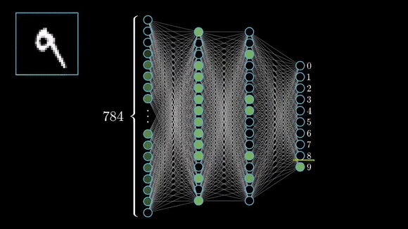

# Implementing and Optimizing Machine Learning Algorithms on MNIST Handwritten Dataset

This repository aims to apply various machine learning algorithms to the MNIST handwritten digit classification problem and compare their performance and optimization techniques.

## Dataset

The MNIST dataset is a collection of 70,000 grayscale images of handwritten digits from 0 to 9, each of size 28 x 28 pixels. The dataset is split into 60,000 training images and 10,000 test images. The dataset is available from https://www.kaggle.com/competitions/digit-recognizer/data

## Algorithms Implemented

The following algorithms are implemented and optimized in this project:

- **Logistic Regression:** A linear model that uses a sigmoid function to output the probability of a class label.
- **K-nearest neighbours:** A non-parametric method that assigns a class label based on the majority vote of the k closest neighbours in the feature space.
- **Decision Tree Classifier:** A tree-based model that splits the feature space into regions based on a series of rules and assigns a class label to each region.
- **Support Vector Machine:** A kernel-based model that finds the optimal hyperplane that separates the classes with the maximum margin.
- **Convolutional Neural Network:** A deep learning model that consists of convolutional, pooling, and fully connected layers and learns hierarchical features from the images.

## Optimization Techniques

- **Logistic Regression:** The learning rate is tuned using a grid search to find the optimal value that minimizes the cross-entropy loss. A regularization term is added to the loss function to prevent overfitting and reduce the variance of the model.
- **K-nearest neighbours:** The number of neighbours is tuned using a grid search to find the optimal value that maximizes the accuracy. A distance metric is chosen based on the similarity of the features. A weighted voting scheme is used to give more importance to the closer neighbours.
- **Decision Tree Classifier:** The depth of the tree is tuned using a grid search to find the optimal value that balances the bias-variance trade-off. A pruning technique is applied to reduce the complexity of the tree and avoid overfitting. An entropy-based criterion is used to select the best split at each node.
- **Support Vector Machine:** The kernel function is tuned using a grid search to find the optimal value that captures the non-linearity of the data. A regularization parameter is tuned to control the margin width and the penalty for misclassification. A scaling technique is applied to normalize the features and improve the convergence of the algorithm.
- **Convolutional Neural Network:** The number of filters, kernel size, and stride are tuned to optimize the feature extraction process. The number of hidden layers and units are tuned to optimize the representation learning process.

## Performance Metrics

The following metrics are used to evaluate the performance of the algorithms:

- Accuracy: The proportion of correctly classified images out of the total number of images.
- Precision: The proportion of correctly classified images out of the total number of images predicted as a class.
- Recall: The proportion of correctly classified images out of the total number of images belonging to a class.
- F1-score: The harmonic mean of precision and recall.
- Confusion Matrix: A table that shows the number of true positives, false positives, false negatives, and true negatives for each class.

## Results

The following table summarizes the results of the algorithms on the test set after applying the optimization techniques:

| Algorithm                    | Accuracy  | Train Time | Normalizer |
|------------------------------|-----------|------------|------------|
| Logistic Regression          | 91.92%    | 23.8s      | Standard   |
| K-Nearest Neighbours         | 97.02%    | 0.03s      | Img Norm   |
| Decision Tree Classifier     | 86.21%    | 3.0s       | Img Norm   |
| Support Vector Machine       | 98.07%    | 57.3s      | Img Norm   |
| Convolutional Neural Network | 99.77%    | 155s       | Img Norm   |

The results show that the convolutional neural network achieved the best performance among the algorithms, followed by the support vector machine. The decision tree classifier achieved the lowest performance among the algorithms.

## Observations

| Algorithm                    | Observation  |
|------------------------------|--------------|
| Logistic Regression          |Logistic Regression plateaus around 92% accuracy as it does not have the parameter complexity to account for the whole dataset. Whilst Logistic Regression with its **One vs Rest** strategy may be able to classify unique entries, it will often times struggle in confidently predicting the digits which have many similar features for eg: 0, 8, 9 all have similar curves and holes leading to model confusion and poor predictions. | The KNN algorithm is a distance based algorithm which estimates the data label based on its N nearest neighbours. Since the MNIST dataset has many entries with features that generally represent a particular label, there is a high probability that an unknown entry may have features similar to its label and may get placed among its neighbours of the same class. This gives excellent accuracy on the absolute points, however KNN fails to correctly classify those points which are anomalies and may not represent the general features of the particular label. |
| Decision Tree Classifier     | The Decision Tree Classifier yields a flow chart like tree which produces predictions based on conditional nodes and branches of the trees leading to a leaf node. The sparsity of the dataset as well as the feature similarites shared across labels means that the decision tree will not be able to produce pure splits with a zero entropy. This yields a poorly classifying model incapable of confidently predicting the correct label. The performance can be increased by performing t-SNE or TSVD where only the most important features representing each label are kept. This will reduce the ambiguity within the dataset and allow a generelized tree to be developed. |
| Support Vector Machine       | The SVM algorithm provides a highly desireable accuracy of 98%. This is due to its complexity and the ability to split complex data into labels using hyperplanes. The SVM algorithm represents the datset into a multi-dimensional space and uses hyperplanes which a seperating planes that can exhibit a functional shape useful for splitting the data into respective labels. The hyperplane is formed on the basis of the support vectors which are basically points that share similar features to multiple labels due to which the datapoint is difficult to classify. By applying the principle of maximizing the support vector distance, optimum planes are found for accurate classification of the dataset. |
| Convolutional Neural Network | CNN are most suited for a task such as Handwritten Digit Reconition due to its ability of automated feature extraction which efficiently combats the high dimensionality and sparsity present within the dataset. CNN achieves a near state of the art accuracy of 99.7% due to its ability of feature extraction and non linear function approximation. This is one of the best performing implementations for this dataset. |

## References

⚠️ Yet to be completed